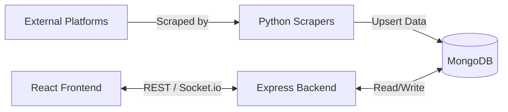

<div align="center">
  
  
  # 🌍 GigWorld
  
  **Your One-Stop Destination for Freelancers**

  [](https://reactjs.org/)
  [](https://nodejs.org/)
  [](https://www.mongodb.com/)
  [](https://www.python.org/)
  [](https://opensource.org/licenses/MIT)

</div>

---

GigWorld is a comprehensive job aggregation platform tailored for freelancers seeking work opportunities. This project scrapes freelancing job listings from multiple popular websites and presents them in a unified, user-friendly interface. It also enables companies to post job openings directly, creating a hybrid marketplace where freelancers can browse both aggregated and direct opportunities.

## 📑 Table of Contents

- [✨ Features](#-features)
- [🛠️ Tech Stack](#️-tech-stack)
- [🏗️ System Architecture](#️-system-architecture)
- [🚀 Getting Started](#-getting-started)
  - [Prerequisites](#prerequisites)
  - [Installation](#installation)
- [📚 API Documentation](#-api-documentation)
- [🤝 Contributing](#-contributing)
- [📄 License](#-license)

---

## ✨ Features

- **Multi-source Job Aggregation:** Automatically scrapes and deduplicates listings from 8+ major platforms (Upwork, Freelancer, Remote.ok, etc.).
- **Direct Job Posting:** Companies can register and post jobs directly to the platform.
- **Unified Freelancer Dashboard:** Browse, filter, and apply for jobs all in one place.
- **Job Lifecycle Tracking:** Automatically tracks job status (new → active → expired) to keep listings fresh.
- **Real-time Updates:** Get live notifications and updates via Socket.io.
- **Robust Authentication:** Secure JWT-based authentication and Google OAuth 2.0 integration.

---

## 🛠️ Tech Stack

**Frontend:**
- React.js 18 (Vite)
- Tailwind CSS 3.4
- React Router v6
- Axios & Boxicons

**Backend:**
- Node.js & Express.js
- MongoDB & Mongoose ORM
- Socket.io (Real-time)
- JWT & bcrypt (Auth)
- Nodemailer & Multer

**Scraper:**
- Python 3
- BeautifulSoup4 & Requests
- PyMongo
- Scheduled Workers

---

## 🏗️ System Architecture

The system operates in a hybrid micro-architecture where background Python scripts perform scheduled scraping from external sources, populating the central MongoDB database. The Node.js Express backend serves this data via REST API to the React frontend while handling real-time features and direct user interactions.



---

## 🚀 Getting Started

Follow these instructions to set up the project locally for development and testing.

### Prerequisites

Ensure you have the following installed:
- [Node.js](https://nodejs.org/) (v16+)
- [Python](https://www.python.org/) (v3.8+)
- [MongoDB](https://www.mongodb.com/) (Local or Atlas URL)

### Installation

1. **Clone the repository:**
   ```bash
   git clone https://github.com/dev261004/GigWorld.git
   cd GigWorld
   ```

2. **Backend Setup:**
   ```bash
   cd backend
   npm install
   ```
   *Create a `.env` file in the `backend/` directory (see [Environment Variables](#environment-variables)).*
   ```bash
   npm run dev
   ```

3. **Frontend Setup:**
   ```bash
   cd ../frontend
   npm install
   ```
   *Create a `.env` file in the `frontend/` directory with `VITE_API_URL=http://localhost:5000/api/v1`.*
   ```bash
   npm run dev
   ```

4. **Scraper Setup:**
   ```bash
   cd ../scraper
   pip install -r requirements.txt
   ```
   *Create a `.env` file with `MONGODB_URI`.*
   ```bash
   python freelancer.py  # To run a specific scraper manually
   ```

### Environment Variables

You will need the following environment variables in your `backend/.env` file:

```env
MONGODB_URI=mongodb://localhost:27017/gigworld
JWT_SECRET=your_jwt_secret
JWT_EXPIRY=7d
GOOGLE_CLIENT_ID=your_client_id
GOOGLE_CLIENT_SECRET=your_client_secret
PORT=5000
NODE_ENV=development
```

---

## 📚 API Documentation

Here is a quick overview of the core REST endpoints available in the backend API.

| Endpoint | Method | Description | Auth Required |
|----------|--------|-------------|---------------|
| `/api/v1/users/register` | `POST` | Register a new user (Freelancer/Company) | No |
| `/api/v1/users/login` | `POST` | Authenticate user and get JWT | No |
| `/api/v1/jobs` | `GET` | Get a paginated list of all active jobs | No |
| `/api/v1/jobs` | `POST` | Create a new job post | Yes (Company) |
| `/api/v1/jobs/:jobId/apply` | `POST` | Apply for a specific job | Yes (Freelancer) |
| `/api/v1/users/profile` | `GET` | Get current user's profile | Yes |

*For full Request/Response schemas, refer to the [Detailed API Docs](PROJECT_OVERVIEW.md).*

---

## 🤝 Contributing

Contributions make the open-source community such an amazing place to learn, inspire, and create. Any contributions you make are **greatly appreciated**.

1. Fork the Project
2. Create your Feature Branch (`git checkout -b feature/AmazingFeature`)
3. Commit your Changes (`git commit -m 'Add some AmazingFeature'`)
4. Push to the Branch (`git push origin feature/AmazingFeature`)
5. Open a Pull Request

---

## 📄 License

This project is distributed under the MIT License. See the [LICENSE](LICENSE) file for more information.

<div align="center">
  <b>Built with ❤️ by <a href="https://github.com/dev261004">Dev Agrawal</a></b>
</div>
